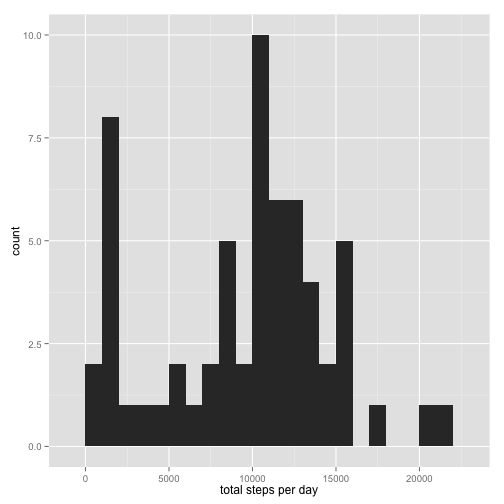

# Peer Assignment

## Download data script

```r
if (!file.exists("../data/activitydata.zip")) {
    download.file(url = "https://d396qusza40orc.cloudfront.net/repdata%2Fdata%2Factivity.zip", 
        destfile = "../data/activitydata.zip", method = "curl")
    unzip(zipfile = "../data/activitydata.zip", exdir = "../data/", overwrite = TRUE)
}
```


## Impute missing values


```r
rawdata <- read.csv(file = "../data/activity.csv")
plotdata <- rawdata
meansteps <- aggregate(steps ~ interval, data = rawdata, FUN = median)
plotdata[is.na(plotdata$steps), ]$steps <- meansteps$steps[match(plotdata[is.na(plotdata$steps), 
    ]$interval, meansteps$interval)]
```


## Set up data for plotting

```r
plotdata$date <- as.Date(plotdata$date)
plotdata$day <- weekdays(plotdata$date)
plotdata$weekpart <- "weekday"
plotdata[which(plotdata$day == "Saturday" | plotdata$day == "Sunday"), ]$weekpart <- "weekend"
plotdata$weekpart <- as.factor(plotdata$weekpart)
```


## Show totals

### Histogram

TODO - Histogram

### Mean and median - use xtable and asis

TODO - Mean data

## Plot daily activity pattern

```r
library(ggplot2)
qplot(interval, steps, data = plotdata, facets = weekpart ~ ., stat = "summary", 
    fun.y = "mean", geom = "line")
```

 

